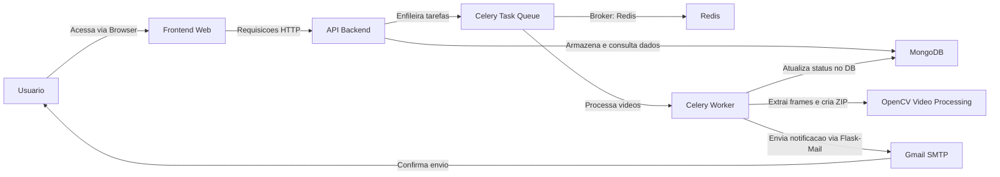

# FrameFlow - Extração de Quadros de Vídeos

O **FrameFlow** é uma aplicação completa para processamento de vídeos, que permite extrair quadros em intervalos configuráveis, compactá-los em um arquivo ZIP e disponibilizá-los para download. A aplicação também inclui autenticação, listagem de status dos vídeos, notificações por email e uma suíte de testes unitários, garantindo alta qualidade e escalabilidade.

---

## Funcionalidades

- **Upload de Vídeo:**  
  Permite que o usuário faça o upload de um vídeo por meio de uma interface web.

- **Processamento Assíncrono:**  
  Utiliza Celery e Redis para processar múltiplos vídeos simultaneamente sem perder requisições em picos de demanda.

- **Extração de Quadros:**  
  Extrai quadros do vídeo a cada intervalo configurável (em segundos) utilizando OpenCV.  
  Salva também informações como FPS e quantidade de frames extraídos.

- **Compactação em ZIP:**  
  Os frames extraídos são compactados em um arquivo ZIP para facilitar o download e a transferência.

- **Download do ZIP:**  
  Disponibiliza o arquivo ZIP para download via um endpoint seguro.

- **Autenticação e Autorização:**  
  O sistema é protegido por autenticação via JWT, garantindo que cada usuário só tenha acesso aos seus dados.

- **Listagem de Vídeos Processados:**  
  Exibe, para cada usuário, uma lista dos vídeos enviados, com status, data de criação (formatada como _"Criado às HH:mm de DD/MM/YYYY"_), FPS, e quantidade de frames extraídos, além de um link para download do ZIP (quando disponível).

- **Notificações por Email:**  
  Ao final do processamento do vídeo, o sistema envia um email (via Flask-Mail e Gmail) informando o status do processamento. Se o vídeo for processado com sucesso, o email incluirá a URL completa para download do arquivo ZIP; caso haja falha, o email informará o erro.

- **Testes Unitários e de Integração:**  
  Uma suíte de testes automatizados (usando pytest) cobre os principais endpoints (autenticação, upload, listagem e processamento), garantindo a qualidade e a estabilidade do projeto.

- **CI/CD:**  
  O projeto está preparado para integração e deploy contínuos utilizando pipelines (exemplo: GitHub Actions).

---

## Arquitetura



- **Frontend:**  
  - Interface web construída com HTML, CSS e JavaScript.
  - Responsiva e integrada com o backend via API REST.

- **Backend:**  
  - API REST desenvolvida com Flask.
  - Processamento de vídeo com OpenCV.
  - Tarefas assíncronas gerenciadas por Celery com Redis como broker.
  - Persistência de dados utilizando MongoDB.

- **Containerização:**  
  - Utiliza Docker para isolar o ambiente e facilitar o deploy em diferentes ambientes.
  - O Docker Compose gerencia os serviços: frontend, backend, Celery Worker, Redis e MongoDB.

---

## Estrutura do Projeto

```bash
.
├── backend
│   ├── app
│   │   ├── __init__.py
│   │   ├── auth.py
│   │   ├── config.py
│   │   ├── routes.py
│   │   ├── tasks.py
│   │   ├── utils.py
│   │   └── video_processing.py
│   ├── Dockerfile
│   ├── requirements.txt
│   └── run.py
├── frontend
│   ├── app.js
│   ├── Dockerfile
│   ├── index.html
│   └── style.css
├── tests
│   ├── __init__.py
│   ├── test_auth.py
│   ├── test_routes.py
│   └── test_video_processing.py
├── docker-compose.yml
└── README.md
```

## Pré-requisitos

- **Docker:**
Certifique-se de ter o Docker instalado na sua máquina.
Instruções de instalação do Docker

- **Git:**
Para clonar e versionar o código.

## Como Rodar o Projeto com Docker

### Clone o repositório:

```bash
git clone https://github.com/SeuUsuario/FrameFlow.git
cd FrameFlow
```

### Construa os containers do Docker:

```bash
docker-compose build
```

### Inicie os containers:

```bash
docker-compose up
```

> O backend estará disponível em: http://localhost:5000

> O frontend estará disponível em: http://localhost:8080

## Configuração de Ambiente
As configurações sensíveis, como credenciais do MongoDB, do Gmail e do broker do Celery, devem ser definidas em um arquivo .env na raiz do projeto (não versionado):

> env

## Exemplo de .env
```env
MONGO_URI=
UPLOAD_FOLDER=./uploads
ZIP_FOLDER=./zips
SECRET_KEY=super-secret-key
JWT_SECRET_KEY=super-jwt-secret

MAIL_USERNAME=seuemail@gmail.com
MAIL_PASSWORD=sua-senha-de-aplicativo
MAIL_SERVER=smtp.gmail.com
MAIL_PORT=587
MAIL_USE_TLS=True
MAIL_DEFAULT_SENDER=seuemail@gmail.com

CELERY_BROKER_URL=redis://redis:6379/0
```

# Como Usar a Interface Web
Acesse a interface web:
http://localhost:8080/screens/login/login.html

### Login/Registro:
Faça o login (ou registre um novo usuário) para acessar os recursos protegidos.

### Upload de Vídeo:

- Selecione um vídeo.
- Defina o intervalo desejado para extração de quadros.
- Envie o vídeo e acompanhe o status do processamento.
- Após o processamento, um link para download do arquivo ZIP será disponibilizado.

### Listagem e Monitoramento:
A interface exibe uma lista de vídeos processados, com status, data formatada ("Criado às HH:mm de DD/MM/YYYY"), FPS e quantidade de frames extraídos.
Ao finalizar o processamento de retirada dos frames, o usuário também receberá um email informando sobre o status e o link de download do arquivo ZIP. Se houver erro no processamento, o usuário também receberá uma notificação por email.

## Testes Unitários
Os testes automatizados foram implementados usando pytest.
Para rodar os testes localmente:

### via Docker:

```bash
docker-compose run backend pytest --maxfail=1 --disable-warnings -q
```

## CI/CD
O projeto está preparado para integração contínua.
Um exemplo de pipeline com GitHub Actions (arquivo .github/workflows/ci.yml) foi configurado para executar os testes automaticamente em cada commit.

---

## Contribuindo
- Faça um fork do repositório.
- Crie uma branch para a sua feature (git checkout -b feature/nome-da-feature).
- Faça commit das suas alterações (git commit -m 'Adicionando nova feature').
- Faça push da sua branch (git push origin feature/nome-da-feature).
- Abra um Pull Request.

## Licença
Este projeto está licenciado sob a MIT License.

---

## Observações Finais
O FrameFlow atende aos seguintes requisitos:

- Processamento paralelo de vídeos usando Celery e Redis.
- Proteção de acesso por JWT.
- Armazenamento persistente no MongoDB.
- Notificação por email sobre o status do processamento.
- Testes automatizados e integração contínua.

> Sinta-se à vontade para contribuir e melhorar o projeto!
